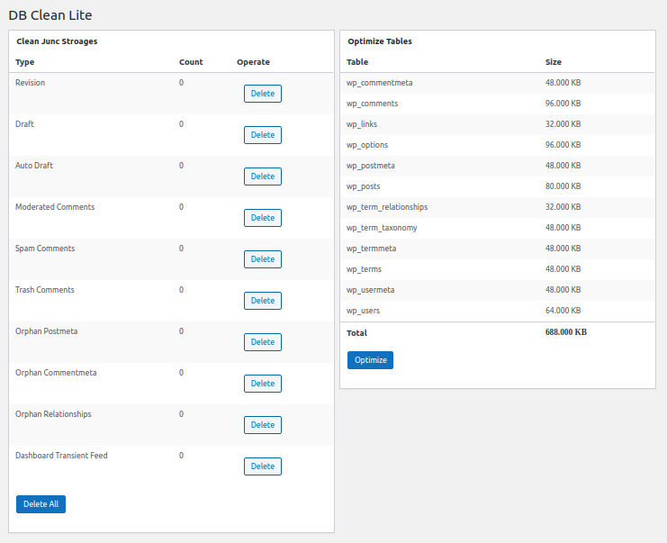

=== WP DB Clean Lite ===

Contributors: filteraction

Donate link: 

Tags: wp db clean, wp cleanup,clean,cleaner,cleanup,database,mysql,comments,posts,post revisions,delete revision,wp cleaner,optimize,optimize database,revision,draft,auto draft,moderated,spam,trash,postmeta,commentmeta,relationships,transient feed,phpMyAdmin,orphan

License: GPLv2

Requires at least: 2.7

Tested up to: 5.5

Stable tag: 1.2.3

DB Clean Lite can help us to clean up the wordpress database by removing "revision" "draft" "auto draft" and so on.

== Description ==

DB Clean Lite can help us to clean up the wordpress database by removing "revision" "draft" "auto draft" "moderated comments" "spam comments" "trash comments" "orphan postmeta" "orphan commentmeta" "orphan relationships" "dashboard transient feed".

It allows you to optimize your WordPress database without phpMyAdmin.

It adds a settings page to "Dashboard"->"Settings"->"DB Clean" where you can clean up the wordpress database.

It allows you to remove the redundant data within few clicks.

It is a effective tool to keep your database clean and surely save a lot of space of your MySQL Database.

= Usage =

1. Download and extract `wp-db-clean-lite.zip` to `wp-content/plugins/`
2. Activate the plugin through the 'Plugins' menu in WordPress.
3. "Dashboard"->"Settings"->"WP Clean Up"
4. For more information of this plugin, please visit: [Plugin Homepage](https://github.com/filteraction/wp-db-clean-lite/ "DB Clean").

Related Links:

== Installation ==

1. Download and extract `wp-db-clean-lite.zip` to `wp-content/plugins/`
2. Activate the plugin through the 'Plugins' menu in WordPress.
3. "Dashboard"->"Settings"->"DB Clean"
4. For more information of this plugin, please visit: [Plugin Homepage](https://github.com/filteraction/wp-db-clean-lite/ "DB Clean").

== Changelog ==

= 1.2.3 =

* mysql_query is deprecated

= 1.2.1 =

* It allows you to remove "revision" "draft" "auto draft" "moderated comments" "spam comments" "trash comments" "orphan postmeta" "orphan commentmeta" "orphan relationships" "dashboard transient feed"

= 1.2.0 =

* It allows you to optimize your WordPress database without phpMyAdmin

= 1.1.1 =

* Some optimization

= 1.1.0 =

* First release.

== Screenshots ==

1. Admin page screenshot 

 2.

== Frequently Asked Questions ==

You can sumbit it in https://github.com/filteraction/wp-db-clean-lite/

== Upgrade Notice ==

Please visit https://github.com/filteraction/wp-db-clean-lite/
